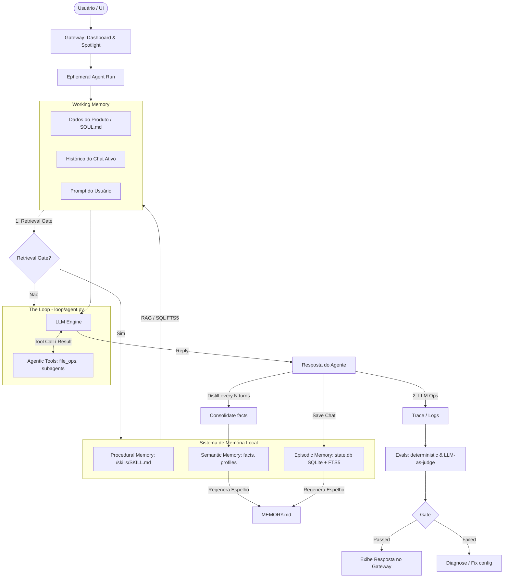

# PRD - Zéfiro (IA Assistant Local de Marketing)

Este documento atua como o **PRD Oficial e Arquitetura de Referência** do Zéfiro. Ele especifica os requisitos de experiência do usuário, modelo mental de IA e decisões técnicas definidas no processo de alinhamento.

---

## 1. Visão Geral do Produto

O Zéfiro é um copiloto local de marketing para infoprodutores, projetado com foco em alta agilidade e zero interrupção. O modelo mental baseia-se no **NotebookLM do Google**, onde os "Notebooks" representam **Produtos** e os botões de ação interna representam **Habilidades (Skills)** que produzem artefatos específicos para o produto ativo.

---

## 2. Requisitos de Experiência de Usuário (UI/UX)

### 2.1. Comportamento e Estrutura de Janelas
- **Janela Única Expansível (Spotlight-to-Dashboard)**: 
  - A aplicação inicia em um modo centralizado simplificado estilo **Spotlight** (barra de pesquisa responsiva no centro da tela para atalhos rápidos).
  - Ao selecionar um produto ou acionar um atalho de expansão, a mesma janela se expande suavemente para o dashboard completo (estilo NotebookLM).
- **Alternador de Widget**:
  - Um botão flutuante discreto posicionado na borda da tela. Clicar nele oculta ou exibe suavemente a janela do Zéfiro por meio de transições de hardware otimizadas.
- **Onboarding e Bloqueio de Habilidades**:
  - **Interface Oculta por Padrão**: As abas e botões de habilidades de marketing permanecem invisíveis até que o primeiro produto seja adicionado e alinhado.
  - O estado inicial apresenta apenas uma tela limpa orientando o usuário a adicionar seu primeiro produto e iniciar a entrevista de alinhamento.

### 2.2. Seletor de Tom (Tone Matrices)
- Configurado diretamente no formulário de cada **Skill**:
  - Toda vez que o usuário executa uma habilidade de escrita (ex: gerar copy), ele pode escolher em um dropdown qual tom quer aplicar:
    1. *Resposta Direta Persuasiva* (Foco em copy clássica de vendas).
    2. *Conversacional Amigável* (Nicho white, tom leve).
    3. *Conformidade / Black Suave* (Evita termos proibidos em canais de Ads).
    4. *Nicho Black Agressivo* (Promessas fortes e urgência).
    5. *Neutro e Informativo* (B2B, relatórios de mercado).
  - Um toggle de **"Linguagem Simples"** (sem anglicismos, focado em públicos de terceira idade) estará disponível por formulário.

---

## 3. Modelo e Arquitetura do Assistente de IA

O Zéfiro é estruturado como um agente local de execução efêmera guiado por memórias e loops de ferramentas estruturadas. Abaixo está o mapeamento detalhado da arquitetura e do fluxo de execução.

### 3.1. Diagrama de Fluxo do Sistema

---

### 3.2. As Camadas de Execução e Memória

1. **Gateway Interface**: Ponto de interação do usuário através do Dashboard (NotebookLM style) e da Spotlight View.
2. **Ephemeral Agent Run & Working Memory**:
   - Cada chamada ou interação cria um ciclo de execução efêmero ("Run").
   - A *Working Memory* consolida de forma temporária o prompt do usuário, o histórico da conversa ativa e o arquivo de posicionamento/alma do produto (`SOUL.md`).
3. **The Loop (LLM ↔ Tools)**:
   - O core do assistente executa chamadas interativas para a LLM, que pode optar por invocar ferramentas (*Agentic Tools*, como ler arquivos, pesquisar na web ou abrir subagentes).
   - O loop possui um limitador (*End-Loop Guardrails*) para evitar custos excessivos de tokens e loops infinitos de execução.
4. **Estrutura de Memória Local**:
   - **Procedural Memory (Como Agir)**: Localizada na pasta `/skills` sob arquivos `SKILL.md`. Define as diretrizes e regras de negócios de cada tarefa.
   - **Semantic Memory (Fatos e Perfis)**: Contém as características estáveis do produto (avatar, dor, promessa).
   - **Episodic Memory (Histórico e Diálogos)**: Armazena as interações passadas do usuário com os agentes no SQLite indexadas para busca com relevância BM25.
5. **Retrieval Gate ("Should we even retrieve?")**:
   - Um filtro de decisão rápido analisa se a pergunta atual do usuário necessita de recuperação de memória de longo prazo. Se não for necessário (ex: perguntas simples ou saudações), o passo de consulta ao banco é pulado para economizar recursos.
6. **Consolidação (Consolidate after N chats)**:
   - A cada *N* turnos de chat, uma rotina em segundo plano analisa o histórico recente e destila aprendizados ou novos fatos para atualizar a *Semantic Memory*.

---

### 3.3. Gerenciamento Físico de Memória: `state.db` vs `MEMORY.md`

Ao contrário de outros assistentes que gerenciam a memória de longo prazo apenas em arquivos Markdown livres, o Zéfiro utiliza uma abordagem de persistência dupla para unir robustez e auditabilidade:
* **Estrutura no Banco (`state.db`)**: O banco de dados SQLite local contém tabelas dedicadas (`facts` para fatos semânticos e `episodes` para episódios do histórico) indexadas por palavras-chave via **FTS5**. Ele serve como a fonte de verdade para as pesquisas do agente.
* **Espelho Humano (`.assistant/MEMORY.md`)**: A cada turno da conversa, o sistema regenera e exporta um arquivo físico Markdown (`.assistant/MEMORY.md`) contendo a compilação consolidada de fatos e históricos.
* **Visualização no App**: O Dashboard oferece duas abas separadas:
  * A aba **Memory** exibe a renderização visual amigável do arquivo `MEMORY.md`.
  * A aba **Database** exibe os dados brutos indexados do `state.db`.

---

### 3.4. Habilidades (Skills) vs. Agentes (Agents)
- **`/skills`**: Armazena prompts e templates utilitários que executam uma única tarefa específica estruturada (fórmulas de copy, análise de anúncios) por meio de inputs de formulário fixos.
- **`/agents`**: Armazena perfis e personas conversacionais de marketing clássico (Sócrates, Aristóteles, Dante, etc.). Os agentes conseguem conversar livremente por chat e podem rodar/chamar as Habilidades para fins específicos.

### 3.5. Ciclo de Vida e Sincronização
- **Sincronização Manual (Hot-Reload)**: Os arquivos de habilidades e agentes são lidos na inicialização. A barra lateral conterá um botão discreto de **"Sincronizar Habilidades"** para realizar o re-scan e sincronizar novos arquivos adicionados manualmente às pastas `/skills` e `/agents`.

### 3.6. LLM Ops: Rastreamento, Evals e Liberação
- **Trace**: Registro contínuo de 1 trace por execução detalhando a trajetória e chamadas feitas ao modelo.
- **Eval**: Módulo de testes locais estruturados em duas pastas de testes automatizados:
  - `evals/deterministic/`: Regras rígidas baseadas em código (ex: tamanho de saída, palavras proibidas, etc.).
  - `evals/judge/`: Testes baseados em LLM-como-juiz (*LLM-as-a-judge*) para certificar a qualidade criativa e de persuasão do marketing.
- **Gate → Release**: Filtro de segurança que decide liberar o resultado gerado apenas se a execução passar nos testes do módulo de Eval. Caso contrário, envia para diagnóstico e reajuste de prompts.

---

## 4. Stack Técnica e Segurança

- **Arquitetura Desktop**: Electron (com Node.js) + React / Vite para o frontend. A comunicação entre a UI (Renderer) e o Core nativo (Main Process) se dará via IPC (Inter-Process Communication).
- **Armazenamento de Chaves Privadas (BYOK)**: As chaves de API (OpenAI, Gemini, Groq, DeepSeek) inseridas pelo usuário no painel de configurações são criptografadas localmente usando a API nativa `safeStorage` do Electron (utilizando o Keychain do macOS e DPAPI do Windows).
- **Consumo de IA**: Chamadas de rede diretas do app local para as APIs dos provedores usando os **SDKs oficiais separados** de cada fabricante (`@google/generative-ai`, `openai`, etc.) importados e instanciados no processo principal da aplicação.

